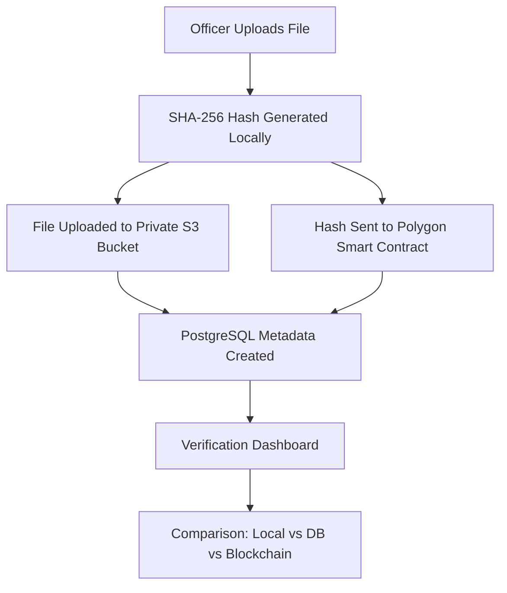
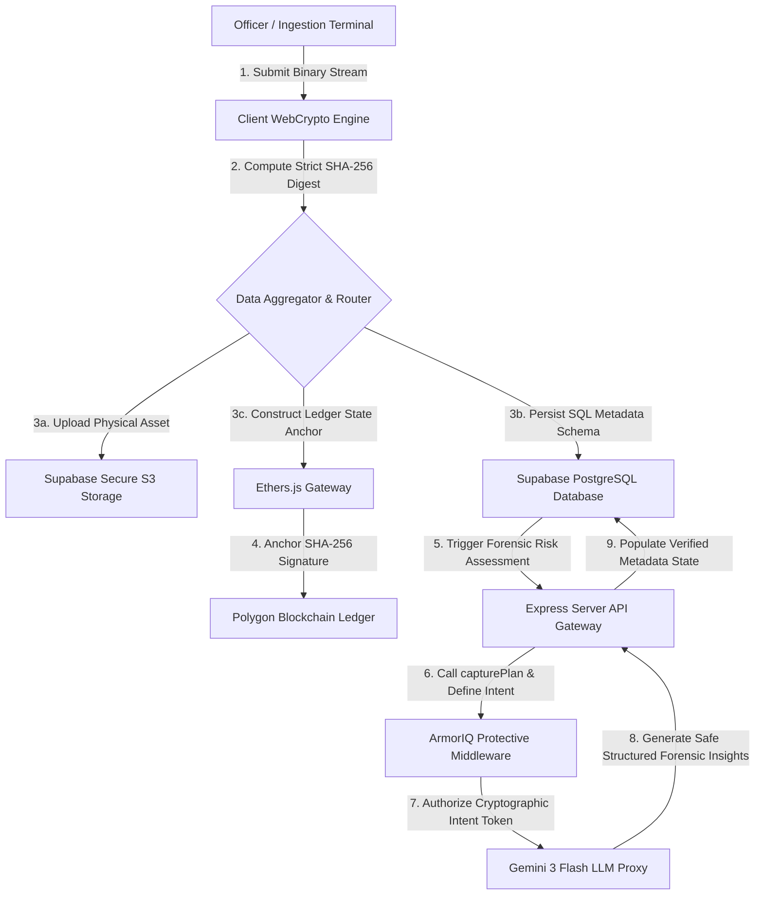
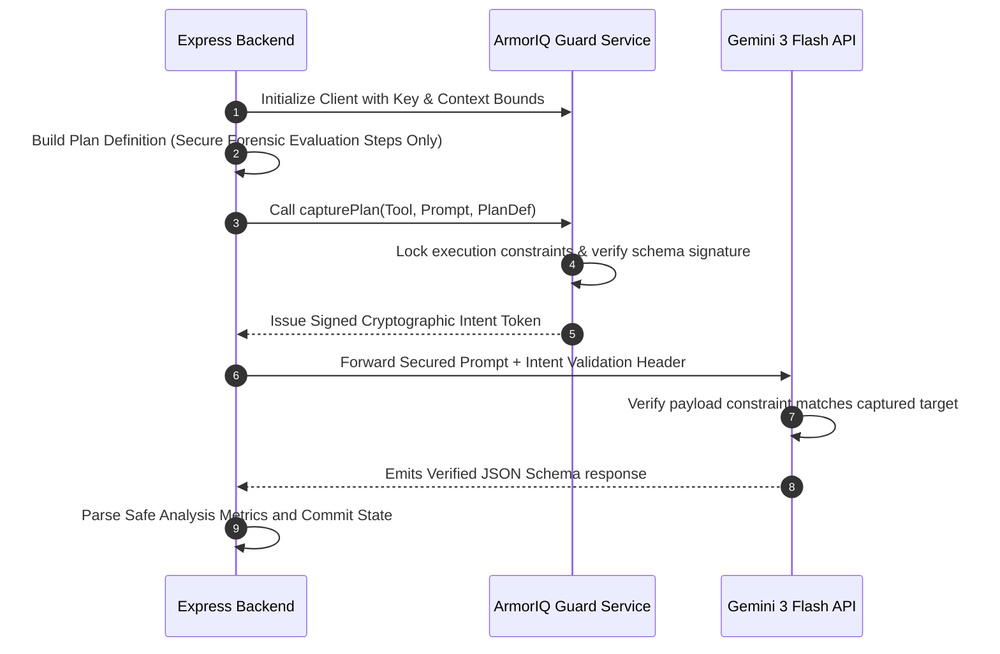

# Evidentia: Secure Ledger and Digital Evidence Intelligence
[](https://reactjs.org/)
[](https://polygon.technology/)
[](https://supabase.com/)
[](https://tailwindcss.com/)
[](https://github.com/)
Evidentia is an enterprise-grade Digital Evidence Management System (DEMS) engineered to enforce absolute, mathematically provable chain-of-custody, forensic audit synchronization, and raw binary integrity verification.
By combining low-latency blockchain key anchoring with cloud state synchronization, and shielding automated analysis via the ArmorIQ API security gateway, Evidentia guarantees that digital evidence holds zero-tampering status from the exact millisecond of ingest.

---
## Tech Stack & Architecture

| Component | Technology | Role |
| :--- | :--- | :--- |
| **Frontend** | React 18, Vite | High-performance SPA with Atomic Design |
| **Logic** | TypeScript | Type-safe forensic operations |
| **Styling** | Tailwind CSS | Custom government-terminal aesthetic |
| **Animation** | Framer Motion | Fluid state transitions and cinematic effects |
| **Database** | Supabase (PostgreSQL) | Metadata storage and system orchestration |
| **Storage** | Supabase Storage (S3) | Encrypted artifact hosting |
| **Blockchain** | Polygon PoS | Immutable SHA-256 hash anchoring |
| **Web3** | Ethers.js | EVM contract interaction |

## 📁 System Architecture



## Technical Security Architecture & Systems Map

Every system database that handles sensitive judicial artifacts faces the Database Administrator (DBA) trust compromise: if an administrative account possesses write, update, or delete privileges on database tables, any record can be silently modified post-facto. 

Evidentia resolves this vulnerability by splitting the state distribution into three distinct layers, integrated into a single unified verification loop:

```mermaid
graph LR
    subgraph STAGE_1 [1. Client Ingest]
        A[WebCrypto API] -->|Generates Hash| B[SHA-256 Digest]
    end
    subgraph STAGE_2 [2. Cloud Storage]
        C[Supabase Storage] -->|Upload Block| D[Encrypted S3 Object]
    end
    subgraph STAGE_3 [3. Public Ledger]
        E[Polygon Blockchain] -->|Secure Anchor| F[On-Chain SHA Signature]
    end
    subgraph STAGE_4 [4. AI Shield]
        G[ArmorIQ Gateway] -->|Intent Token Lock| H[Gemini 3 Flash LLM]
    end

    B -->|Ingest Stream| C
    D -->|State Sync| E
    F -->|Forensic Audit| G
```


## Systems Topology Diagram

The following logical sequence illustrates data orchestration across physical, relational, and decentralized state boundaries during intake operations:



---

## Blockchain Zero-Knowledge Verification

Integrating decentralized ledger anchoring in a live production environment provides ironclad protection against typical state manipulation exploits:

### Zero-Knowledge Architecture
To maintain strictly confidential operations, raw file binary payloads are never transmitted to public block scanners. Only the deterministically generated **32-byte SHA-256 hash digest** of the asset acts as the on-chain anchor.

### Complete Non-Repudiation
Officers sign block transitions using individual cryptographic certificates before execution. State changes recorded on-chain provide legal proof of ownership and capture chronologies that cannot be denied or erased.

### Independent Decoupled Auditing
Attorneys, external validators, or magistrates can verify the mathematical integrity of any electronic evidence using only public smart contracts. The validation mechanism compares three distinct hash points directly in real-time, functioning completely offline from the main storage network:

```
                  [ COMPLIANCE LEDGER HARMONY ENGINE ]
 
                     User Dropped Evidentiary Item
                                   |
                                   v
                      Local WebCrypto SHA-256 Hash
                                   |
                             Target Hash (A)
                                   |
             +---------------------+---------------------+
             |                                           |
             v                                           v
  [ Supabase DB Records ]                      [ Polygon Smart Contract ]
  Query Recorded Metadata                     Query Immutable Blockchain Block
             |                                           |
       Database Hash (B)                          Signed Contract Hash (C)
             |                                           |
             +---------------------+---------------------+
                                   |
                                   v
                    Cryptographic Comparator Loop
                       
                         Compare Hash (A) === (B) === (C)
                         
             +---------------------+---------------------+
             | Match                                     | Mismatch Detected
             v                                           v
   [ Record Verified Authentic ]               [ SYSTEM ALERT: TAMPER EXPOSURE ]
   State: Clean Integrity                      State: Immediate Compromise Trigger
```

---

## Detailed ArmorIQ AI Security Protection

Traditional Large Language Models (LLMs) used in forensic pipeline reporting are subject to serious threats:
* **LLM Jailbreaking / Prompt Injections**: Cleverly manipulated text layers or hidden binary codes inside artifacts could hijack the AI system prompt, causing it to misclassify critical evidence risks.
* **Unauthorized AI State Alterations**: Uncontrolled execution loops can leak context boundaries or allow untracked decisions within database state definitions.

### The Guarded Ingestion Solution
Evidentia completely addresses this by routing the Gemini model evaluation inside the **ArmorIQ API Guarding Framework**. No instruction is fired directly at the model; instead, the system defines a immutable, signed **Execution Plan Boundary** through the ArmorIQ SDK before processing context.



---

## Core Code Verification

Evidentia deploys the ArmorIQ safeguarding pipeline directly within its Express API gateway `/server.ts`. This verified code demonstrates exactly how the integration shields the system:

```typescript
import express from "express";
import { GoogleGenAI } from "@google/genai";
import { ArmorIQClient } from '@armoriq/sdk';

const app = express();

// Instantiate the Secure ArmorIQ Guarding Agent
const armoriqClient = new ArmorIQClient({
  apiKey: process.env.ARMORIQ_API_KEY || "ak_production_secret",
  userId: "evidentia-forensic-operator",
  agentId: "evidentia-forensic-agent",
  contextId: "evidentia-default"
});

// Configure Google Gemini core SDK
const ai = new GoogleGenAI({ apiKey: process.env.GEMINI_API_KEY });

app.post("/api/analyze-evidence", async (req, res) => {
  try {
    const { metadata } = req.body;
    
    // 1. Establish the locked system prompt
    const prompt = `
      Analyze the following digital evidence metadata forensically:
      ${JSON.stringify(metadata, null, 2)}
      
      Output structurally perfect JSON containing:
      - summary: Short objective description of the asset characteristics.
      - riskScore: Numeric float boundary [0 - 100] marking modification likelihood.
      - observations: Flat string array of individual visual checks.
    `;

    // 2. Lock the model execution bounds strictly using the ArmorIQ SDK
    const planDefinition = {
      goal: 'Analyze evidence metadata forensically',
      steps: [
        {
          action: 'generate_forensic_insights',
          tool: 'gemini-3-flash-preview',
          inputs: { hash: metadata.hash }
        }
      ]
    };
    
    // 3. Negotiate constraints with the security bridge to lock-in forensic intention
    const planCapture = armoriqClient.capturePlan(
      'gemini-3-flash-preview', 
      prompt, 
      planDefinition
    );
    
    const intentToken = await armoriqClient.getIntentToken(planCapture);
    console.log("ArmorIQ Cryptographic Plan locked, Intent Token:", intentToken?.tokenId);

    // 4. Securely execute target model transaction
    const response = await ai.models.generateContent({
      model: "gemini-3-flash-preview",
      contents: prompt,
      config: {
        responseMimeType: "application/json",
        temperature: 0.1,
      }
    });

    res.json(JSON.parse(response.text || '{}'));
  } catch (err) {
    res.status(500).json({ error: "Cryptographic validation or LLM parsing error" });
  }
});
```

---

## Production Benefits

Implementing this secure combination of Supabase PostgreSQL, Polygon mainnet transactions, and the ArmorIQ SDK yields major operational advantages:

| Production Driver | Legacy Evidence Registers | Evidentia Solution Ledger |
| :--- | :--- | :--- |
| **Insider Defiance** | DBA can update logs or wipe tables silently | Tampering creates an instant, structural hash-mismatch against on-chain consensus |
| **AI Evaluation Trust** | Susceptible to instruction hijacking or malicious asset inputs | Protected under the ArmorIQ intent loop, restricting AI output to strict JSON schemas |
| **Legal Admissibility** | System reports can be challenged as easily modifiable | Cryptographically certified PDF logs linked directly with blockchain block sequence numbers |
| **Multi-Agency Access** | Requires raw read-write database clearance configurations | Secure QR links distribute read access safely with zero system breach risks |

---

## System Configuration and Operational Launch

### 1. Requirements
* Node.js Version 18.0.0 or higher
* npm package manager

### 2. Environment Variables Configuration
To set up active network environments, write system keys inside the local `.env` file within the project root:

```env
# Supabase Core Variables
VITE_SUPABASE_URL=https://your-project.supabase.co
VITE_SUPABASE_ANON_KEY=ABCDEF...

# Polygon Smart Contract Details
VITE_CONTRACT_ADDRESS=0x946bddl......
VITE_BLOCKCHAIN_RPC_URL=https://polygon-mainnet.infura.io/v3/...

# Secure AI Intelligence & Shielding Credentials
GEMINI_API_KEY=AIzaSy...
ARMORIQ_API_KEY=ak_...
```

### 3. Execution Scripts
Run standard terminal operations to build, verify, and run the containerized backend and frontend interface elements:

```bash
# Clean install necessary package architectures
npm install

# Compile full production builds across standard environments
npm run build

# Direct standalone local execution
npm run start
```

---

## Regulatory Compliance Declaration
Evidentia has been explicitly engineered to conform with standard Electronic Signature Preservation guidelines and aligns with CJIS (Criminal Justice Information Services) security directives for digital custodianship. Any manual modifications, log deletion, or bypass attempts of the ArmorIQ secure tracking layer will instantly compromise validation consensus and broadcast real-time network telemetry alerts.

