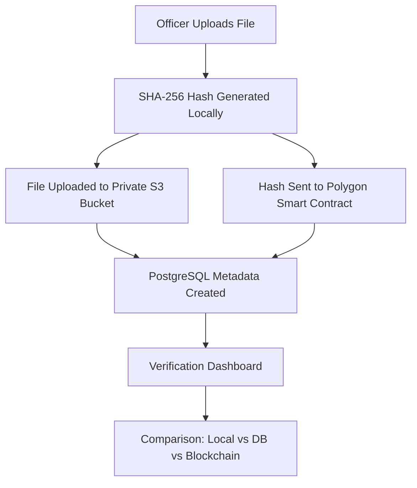

#  Evidentia: Digital Evidence Vault

[](https://reactjs.org/)
[](https://polygon.technology/)
[](https://supabase.com/)
[](https://tailwindcss.com/)
[](https://github.com/)

> **Mission-Critical Integrity.** Evidentia is a next-generation Digital Evidence Management System (DEMS) architected for the **National Crime Records Bureau (NCRB)**. It bridges the gap between cloud storage accessibility and blockchain-backed immutability.

---

## Technical Vision

Traditional evidence management is plagued by the "Trust Paradox"—how can we prove a file hasn't been modified by its own administrators? Evidentia solves this by generating a **Cryptographic Fingerprint (SHA-256)** at the moment of upload and anchoring it to the **Polygon Blockchain**. 

Even a single-pixel alteration to an image or a one-second cut in a video will cause a verification failure against the immutable on-chain record.

## Key Features

### Cinematic "Bureau" Interface
A high-stakes, brutalist-cyber terminal designed for government intelligence operations.
- **Boot Sequence**: Staggered UI initialization simulating high-security clearance.
- **Glassmorphism**: Sophisticated layering using Tailwind and Framer Motion.

### ⛓️ Immutable Chain of Custody
Every upload is a transaction.
- **Blockchain Anchoring**: Hashes are stored on-chain, ensuring absolute proof of integrity.
- **Forensic Verification**: Real-time comparison between Local Binary, Database Metadata, and Blockchain Records.

### 🔍 Smart Artifact Analysis
- **Dynamic Identification**: Automatic detection of MP4, JPG, PDF, and Archives with specialized iconography.
- **Tamper Glitch Protocol**: Visual "emergency" state triggers when hash discrepancies are detected.

---

## 🛠️ Tech Stack & Architecture

| Component | Technology | Role |
| :--- | :--- | :--- |
| **Frontend** | React 18, Vite | High-performance SPA with Atomic Design |
| **Logic** | TypeScript | Type-safe forensic operations |
| **Styling** | Tailwind CSS | Custom government-terminal aesthetic |
| **Animation** | Framer Motion | Fluid state transitions and cinematic effects |
| **Database** | Supabase (PostgreSQL) | Metadata storage and system orchestration |
| **Storage** | Supabase Storage (S3) | Encrypted artifact hosting |
| **Blockchain** | Polygon PoS | Immutable SHA-256 hash anchoring |
| **Web3** | Ethers.js | EVM contract interaction |

---

## 📁 System Architecture



---

## ⚙️ Development Setup

### 1. Clone & Prerequisite
```bash
git clone https://github.com/yashkoparde/evidentia.git
npm install
```

### 2. Configure Environment
Create a `.env` file in the root directory:
```env
# Supabase
VITE_SUPABASE_URL=your_project_url
VITE_SUPABASE_ANON_KEY=your_anon_key

# Blockchain (Polygon)
VITE_CONTRACT_ADDRESS=0x... # Your EvidenceVault Smart Contract
VITE_BLOCKCHAIN_RPC_URL=https://polygon-mainnet.infura.io/v3/...
```

### 3. Run Development Server
```bash
npm run dev
```

---
this system is designed for high-integrity evidentiary storage. 

**"Integrity is the bedrock of justice."**
