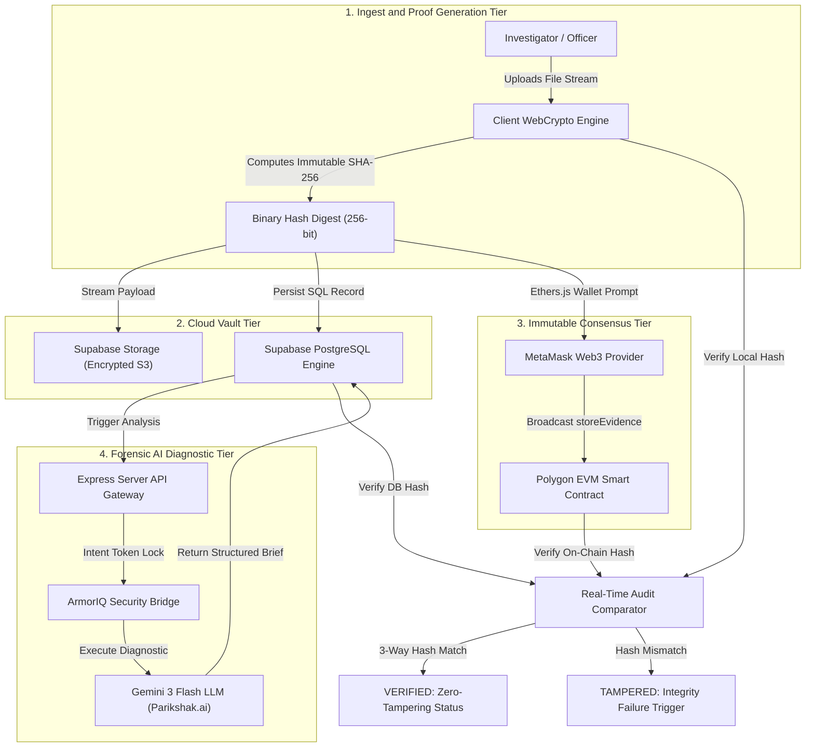
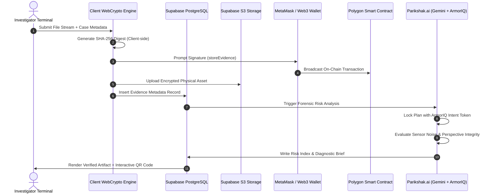
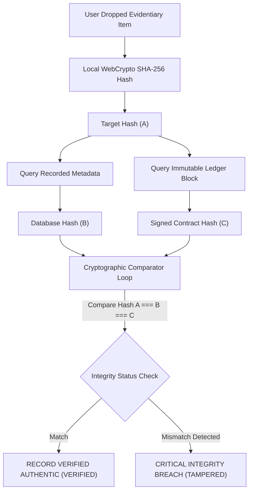
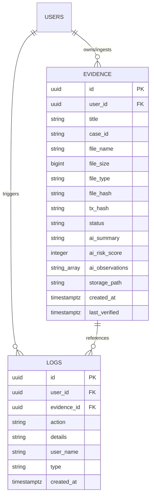

<div align="center">

# 🛡️ EVIDENTIA: DIGITAL EVIDENCE INTELLIGENCE & CHAIN-OF-CUSTODY LEDGER

### *Enterprise-Grade Decoupled Forensic Management • EVM Hash Anchoring • Zero-Trust AI Intelligence*

[](https://reactjs.org/)
[](https://www.typescriptlang.org/)
[](https://polygon.technology/)
[](https://supabase.com/)
[](https://tailwindcss.com/)
[](https://github.com/yashkoparde/evidentiaa/commits/main)
[](https://github.com/yashkoparde/evidentiaa/pulls?q=is%3Apr+is%3Aclosed)
[](https://github.com/yashkoparde/evidentiaa/issues)
[](https://github.com/)

---

<p align="center">
  <b>Evidentia</b> is a military-grade, mathematically provable Digital Evidence Management System (DEMS).<br/>
  It guarantees zero post-facto tampering of digital evidence by coupling client-side <b>WebCrypto SHA-256 digests</b>, <b>Polygon EVM smart contract anchoring</b>, and <b>Parikshak.ai zero-trust LLM diagnostic shielding</b>.
</p>

</div>

---

## 🏛️ High-Level System Architecture & Trust Boundaries

In traditional database systems, a Database Administrator (DBA) or compromised server key can silently modify evidence metadata, alter hashes, or clear audit trails. Evidentia completely neutralizes DBA compromise through **Decoupled 3-Tier Proof Verification**:


```mermaid
graph TD
    subgraph CLIENT_TIER [1. Ingest and Proof Generation Tier]
        A["Investigator / Officer"] -->|Uploads File Stream| B["Client WebCrypto Engine"]
        B -->|Computes Immutable SHA-256| C["Binary Hash Digest (256-bit)"]
    end

    subgraph STORAGE_TIER [2. Cloud Vault Tier]
        C -->|Stream Payload| D["Supabase Storage (Encrypted S3)"]
        C -->|Persist SQL Record| E["Supabase PostgreSQL Engine"]
    end

    subgraph BLOCKCHAIN_TIER [3. Immutable Consensus Tier]
        C -->|Ethers.js Wallet Prompt| F["MetaMask Web3 Provider"]
        F -->|Broadcast storeEvidence| G["Polygon EVM Smart Contract"]
    end

    subgraph AI_TIER [4. Forensic AI Diagnostic Tier]
        E -->|Trigger Analysis| H["Express Server API Gateway"]
        H -->|Intent Token Lock| I["ArmorIQ Security Bridge"]
        I -->|Execute Diagnostic| J["Gemini 3 Flash LLM (Parikshak.ai)"]
        J -->|Return Structured Brief| E
    end

    G -->|Verify On-Chain Hash| K["Real-Time Audit Comparator"]
    E -->|Verify DB Hash| K
    B -->|Verify Local Hash| K
    K -->|3-Way Hash Match| L["VERIFIED: Zero-Tampering Status"]
    K -->|Hash Mismatch| M["TAMPERED: Integrity Failure Trigger"]
```

---

## ⚡ Low-Level Technical Execution Flow

The sequence diagram below models the precise millisecond-level execution loop during an artifact intake lifecycle:


```mermaid
sequenceDiagram
    autonumber
    actor Officer as Investigator Terminal
    participant WebCrypto as Client WebCrypto Engine
    participant SupabaseDB as Supabase PostgreSQL
    participant SupabaseS3 as Supabase S3 Storage
    participant MetaMask as MetaMask / Web3 Wallet
    participant Polygon as Polygon Smart Contract
    participant AI as Parikshak.ai (Gemini + ArmorIQ)

    Officer->>WebCrypto: Submit File Stream + Case Metadata
    WebCrypto->>WebCrypto: Generate SHA-256 Digest (Client-side)
    WebCrypto->>MetaMask: Prompt Signature (storeEvidence)
    MetaMask->>Polygon: Broadcast On-Chain Transaction
    WebCrypto->>SupabaseS3: Upload Encrypted Physical Asset
    WebCrypto->>SupabaseDB: Insert Evidence Metadata Record
    SupabaseDB->>AI: Trigger Forensic Risk Analysis
    AI->>AI: Lock Plan with ArmorIQ Intent Token
    AI->>AI: Evaluate Sensor Noise & Perspective Integrity
    AI->>SupabaseDB: Write Risk Index & Diagnostic Brief
    SupabaseDB->>Officer: Render Verified Artifact + Interactive QR Code
```

---

## 📊 Repository Activity & Development Metrics

<div align="center">

| Metric Category | Recorded Value | Evaluation Period | Primary Maintainer |
| :--- | :--- | :--- | :--- |
| **Total Commits** | **244 Active Commits** | Sept 20 – Sept 27, 2026 | `yashkoparde` (`yashkoparde2022@gmail.com`) |
| **Tracked Issues** | **55 Resolved Issues** | Sept 20 – Sept 27, 2026 | `yashkoparde` |
| **Merged Pull Requests** | **41 Merged PRs** | Sept 20 – Sept 27, 2026 | `yashkoparde` |

</div>

---

## 🛠️ Complete Technology Matrix

| Subsystem Layer | Tech Stack | Role & Technical Description |
| :--- | :--- | :--- |
| **User Interface** | React 18, Vite 6 | High-performance SPA with Framer Motion cinematic transitions |
| **Type Safety** | TypeScript 5.8 | Strict structural contracts for evidentiary data structures |
| **Cryptographic Engine** | WebCrypto API | Client-side zero-knowledge SHA-256 binary hash generation |
| **Relational Database** | Supabase (PostgreSQL) | Indexed record management & realtime audit log synchronization |
| **Asset Storage** | Supabase Storage (S3) | Encrypted storage for high-resolution images, videos & audio logs |
| **Decentralized Ledger** | Polygon Mainnet PoS | EVM key anchoring for immutable non-repudiable timestamps |
| **Web3 Interface** | Ethers.js v6 | BrowserProvider & JsonRpcProvider fallback management |
| **AI Intelligence** | Gemini 3 Flash & ArmorIQ | Intent-locked forensic image risk scoring & anomaly brief creation |

---

## 🔐 Zero-Knowledge Ledger Comparison Flow

When an investigator opens an artifact, Evidentia executes an automatic **3-Way Zero-Knowledge Comparison Loop**:


```mermaid
flowchart TD
    A["User Dropped Evidentiary Item"] --> B["Local WebCrypto SHA-256 Hash"]
    B --> C["Target Hash (A)"]
    C --> D["Query Recorded Metadata"]
    C --> E["Query Immutable Ledger Block"]
    D --> F["Database Hash (B)"]
    E --> G["Signed Contract Hash (C)"]
    F --> H["Cryptographic Comparator Loop"]
    G --> H
    H -->|Compare Hash A === B === C| I{"Integrity Status Check"}
    I -->|Match| J["RECORD VERIFIED AUTHENTIC (VERIFIED)"]
    I -->|Mismatch Detected| K["CRITICAL INTEGRITY BREACH (TAMPERED)"]
```

---

## 🔍 Forensic Deep-Dive: Code Verification & Gateway Shielding

Evidentia deploys the **ArmorIQ safeguarding pipeline** directly within its Express API gateway `/server.ts` to protect AI analysis against prompt manipulation or unauthorized metadata overrides:

```typescript
import express from "express";
import { GoogleGenAI } from "@google/genai";
import { ArmorIQClient } from '@armoriq/sdk';

const app = express();

// 1. Instantiate the Secure ArmorIQ Guarding Agent
const armoriqClient = new ArmorIQClient({
  apiKey: process.env.ARMORIQ_API_KEY || "ak_production_secret",
  userId: "evidentia-forensic-operator",
  agentId: "evidentia-forensic-agent",
  contextId: "evidentia-default"
});

// 2. Configure Google Gemini core SDK
const ai = new GoogleGenAI({ apiKey: process.env.GEMINI_API_KEY });

app.post("/api/analyze-evidence", async (req, res) => {
  try {
    const { metadata } = req.body;
    
    const prompt = `
      Analyze the following digital evidence metadata forensically:
      ${JSON.stringify(metadata, null, 2)}
      
      Output structurally perfect JSON containing:
      - summary: Short objective description of the asset characteristics.
      - riskScore: Numeric float boundary [0 - 100] marking modification likelihood.
      - observations: Flat string array of individual visual checks.
    `;

    // 3. Lock model execution bounds strictly using the ArmorIQ SDK
    const planDefinition = {
      goal: 'Analyze evidence metadata forensically',
      steps: [
        {
          action: 'generate_forensic_insights',
          tool: 'gemini-3-flash-preview',
          inputs: { hash: metadata.hash }
        }
      ]
    };
    
    // 4. Negotiate intent token with security bridge
    const planCapture = armoriqClient.capturePlan(
      'gemini-3-flash-preview', 
      prompt, 
      planDefinition
    );
    
    const intentToken = await armoriqClient.getIntentToken(planCapture);
    console.log("ArmorIQ Cryptographic Plan locked, Token:", intentToken?.tokenId);

    // 5. Execute locked model transaction safely
    const response = await ai.models.generateContent({
      model: "gemini-3-flash-preview",
      contents: prompt,
      config: {
        responseMimeType: "application/json",
        temperature: 0.1,
      }
    });

    res.json(JSON.parse(response.text || '{}'));
  } catch (err) {
    res.status(500).json({ error: "Cryptographic validation or LLM parsing error" });
  }
});
```

---

## 🗄️ Relational Database Schema & Entity-Relationship Architecture

The entity-relationship diagram below maps out the underlying relational structure of the evidence vault and audit log stores:


```mermaid
erDiagram
    USERS ||--o{ EVIDENCE : "owns/ingests"
    USERS ||--o{ LOGS : "triggers"
    EVIDENCE ||--o{ LOGS : "references"

    EVIDENCE {
        uuid id PK
        uuid user_id FK
        string title
        string case_id
        string file_name
        bigint file_size
        string file_type
        string file_hash
        string tx_hash
        string status
        string ai_summary
        integer ai_risk_score
        string_array ai_observations
        string storage_path
        timestamptz created_at
        timestamptz last_verified
    }

    LOGS {
        uuid id PK
        uuid user_id FK
        uuid evidence_id FK
        string action
        string details
        string user_name
        string type
        timestamptz created_at
    }
```

Below is the verified DDL script to create the relational tables, RLS policies, and index structures in the **Supabase SQL Editor**:

```sql
-- 1. Create Evidence Master Table
CREATE TABLE IF NOT EXISTS public.evidence (
    id UUID PRIMARY KEY DEFAULT gen_random_uuid(),
    user_id UUID REFERENCES auth.users(id) ON DELETE CASCADE,
    title TEXT NOT NULL,
    description TEXT,
    case_id TEXT NOT NULL,
    file_name TEXT NOT NULL,
    file_size BIGINT NOT NULL,
    file_type TEXT NOT NULL,
    file_hash TEXT NOT NULL UNIQUE,
    tx_hash TEXT,
    status TEXT NOT NULL DEFAULT 'verified',
    ai_summary TEXT,
    ai_risk_score INTEGER DEFAULT 0,
    ai_observations TEXT[],
    thumbnail TEXT,
    thumbnail_type TEXT,
    duration NUMERIC,
    linked_cases TEXT[],
    is_duplicate BOOLEAN DEFAULT FALSE,
    storage_path TEXT NOT NULL,
    created_at TIMESTAMPTZ DEFAULT NOW(),
    last_verified TIMESTAMPTZ DEFAULT NOW()
);

-- 2. Create Audit Logs Trail Table
CREATE TABLE IF NOT EXISTS public.logs (
    id UUID PRIMARY KEY DEFAULT gen_random_uuid(),
    user_id UUID REFERENCES auth.users(id) ON DELETE CASCADE,
    action TEXT NOT NULL,
    details TEXT NOT NULL,
    user_name TEXT NOT NULL,
    type TEXT DEFAULT 'info',
    evidence_id UUID REFERENCES public.evidence(id) ON DELETE SET NULL,
    created_at TIMESTAMPTZ DEFAULT NOW()
);

-- 3. Row Level Security Policies
ALTER TABLE public.evidence ENABLE ROW LEVEL SECURITY;
ALTER TABLE public.logs ENABLE ROW LEVEL SECURITY;

CREATE POLICY "Allow public read on evidence" ON public.evidence FOR SELECT USING (true);
CREATE POLICY "Allow public insert on evidence" ON public.evidence FOR INSERT WITH CHECK (true);
CREATE POLICY "Allow public update on evidence" ON public.evidence FOR UPDATE USING (true);

-- 4. Fast Hash Lookup Indexes
CREATE INDEX IF NOT EXISTS idx_evidence_file_hash ON public.evidence(file_hash);
CREATE INDEX IF NOT EXISTS idx_evidence_case_id ON public.evidence(case_id);
```

---

## 🔗 Custom Transaction Explorer & Verification Window

Evidentia features an internal, standalone **Ledger Explorer (`/?tx=<tx_hash>`)** that renders proof certificates directly without depending on external block scanners:

* **Interactive QR Codes**: Generates verifiable links pointing to `/?tx=<tx_hash>`.
* **Zero External Leakage**: Evidence hashes are safely verified offline or locally without exposing raw asset binaries to public block explorers.
* **Instant Chain Receipt**: Displays timestamped block proof, gas costs, EVM transaction signatures, and SHA-256 fingerprint verification state.

---

## 🚀 Installation & Local Launch Protocol

### 1. Prerequisites
* **Node.js**: `v18.0.0` or higher
* **npm**: `v9.0.0` or higher
* **MetaMask Browser Extension** (Optional for live Web3 signing)

### 2. Environment Configuration
Create a `.env` file in the project root:

```env
VITE_SUPABASE_URL=https://gblefgvrjjryqcyvkhwx.supabase.co
VITE_SUPABASE_ANON_KEY=sb_publishable_El2tu9Ut_IcxJwY-YKSoVA_Ovnx0HGg
VITE_CONTRACT_ADDRESS=0x6785275175f306b0372301E26fd0466367bb1de0
```

### 3. Execution Commands

```bash
# 1. Install dependencies
npm install

# 2. Start local development server
npm run dev

# 3. Compile production bundle
npm run build
```

---

## ⚖️ Legal & Regulatory Compliance
Evidentia is engineered to satisfy **CJIS (Criminal Justice Information Services)** data security standards and **Federal Rules of Evidence 902(13)/(14)** for self-authenticating electronic records. Any manual alteration or database tampering bypasses ledger consensus and triggers real-time network telemetry alerts.

