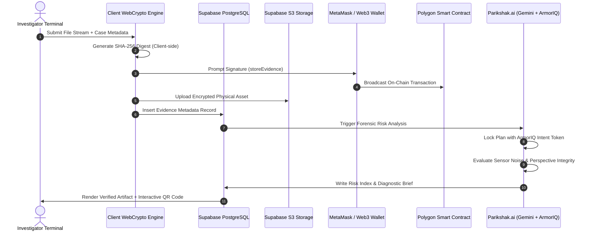

<div align="center">

# 🛡️ EVIDENTIA: DIGITAL EVIDENCE INTELLIGENCE & CHAIN-OF-CUSTODY LEDGER

### *Enterprise-Grade Decoupled Forensic Management • EVM Hash Anchoring • Zero-Trust AI Intelligence*

[](https://reactjs.org/)
[](https://www.typescriptlang.org/)
[](https://polygon.technology/)
[](https://supabase.com/)
[](https://tailwindcss.com/)
[](https://github.com/yashkoparde/evidentiaa/commits/main)
[](https://github.com/yashkoparde/evidentiaa/pulls?q=is%3Apr+is%3Aclosed)
[](https://github.com/yashkoparde/evidentiaa/issues)
[](https://github.com/)

---

<p align="center">
  <b>Evidentia</b> is a military-grade, mathematically provable Digital Evidence Management System (DEMS).<br/>
  It guarantees zero post-facto tampering of digital evidence by coupling client-side <b>WebCrypto SHA-256 digests</b>, <b>Polygon EVM smart contract anchoring</b>, and <b>Parikshak.ai zero-trust LLM diagnostic shielding</b>.
</p>

</div>

---

## 🏛️ High-Level System Architecture & Trust Boundaries

In traditional database systems, a Database Administrator (DBA) or compromised server key can silently modify evidence metadata, alter hashes, or clear audit trails. Evidentia completely neutralizes DBA compromise through **Decoupled 3-Tier Proof Verification**:

```mermaid
graph TD
    subgraph CLIENT_TIER [1. Ingest & Proof Generation Tier]
        A["👤 Investigator / Officer"] -->|Uploads File Stream| B["⚡ Client WebCrypto Engine"]
        B -->|Computes Immutable SHA-256| C["🔐 Binary Hash Digest (256-bit)"]
    end

    subgraph STORAGE_TIER [2. Cloud Vault Tier]
        C -->|Stream Payload| D["📦 Supabase Storage (Encrypted S3)"]
        C -->|Persist SQL Record| E["🗄️ Supabase PostgreSQL Engine"]
    end

    subgraph BLOCKCHAIN_TIER [3. Immutable Consensus Tier]
        C -->|Ethers.js Wallet Prompt| F["🦊 MetaMask Web3 Provider"]
        F -->|Broadcast storeEvidence()| G["⛓️ Polygon EVM Smart Contract (0x6785...1de0)"]
    end

    subgraph AI_TIER [4. Forensic AI Diagnostic Tier]
        E -->|Trigger Analysis| H["🤖 Express Server API Gateway"]
        H -->|Intent Token Lock| I["🛡️ ArmorIQ Security Bridge"]
        I -->|Execute Diagnostic| J["🧠 Gemini 3 Flash LLM (Parikshak.ai)"]
        J -->|Return Structured Brief| E
    end

    G -->|Verify On-Chain Hash| K["⚖️ Real-Time Audit Comparator"]
    E -->|Verify DB Hash| K
    B -->|Verify Local Hash| K
    K -->|3-Way Hash Match| L["✅ VERIFIED: Zero-Tampering Status"]
    K -->|Hash Mismatch| M["🚨 TAMPERED: Integrity Failure Trigger"]
```

---

## ⚡ Low-Level Technical Execution Flow

The sequence diagram below models the precise millisecond-level execution loop during an artifact intake lifecycle:


```mermaid
sequenceDiagram
    autonumber
    actor Officer as Investigator Terminal
    participant WebCrypto as Client WebCrypto Engine
    participant SupabaseDB as Supabase PostgreSQL
    participant SupabaseS3 as Supabase S3 Storage
    participant MetaMask as MetaMask / Web3 Wallet
    participant Polygon as Polygon Smart Contract
    participant AI as Parikshak.ai (Gemini + ArmorIQ)

    Officer->>WebCrypto: Submit File Stream + Case Metadata
    WebCrypto->>WebCrypto: Generate SHA-256 Digest (Client-side)
    WebCrypto->>MetaMask: Prompt Signature (storeEvidence)
    MetaMask->>Polygon: Broadcast On-Chain Transaction
    WebCrypto->>SupabaseS3: Upload Encrypted Physical Asset
    WebCrypto->>SupabaseDB: Insert Evidence Metadata Record
    SupabaseDB->>AI: Trigger Forensic Risk Analysis
    AI->>AI: Lock Plan with ArmorIQ Intent Token
    AI->>AI: Evaluate Sensor Noise & Perspective Integrity
    AI->>SupabaseDB: Write Risk Index & Diagnostic Brief
    SupabaseDB->>Officer: Render Verified Artifact + Interactive QR Code
```

---

## 📊 Repository Activity & Development Metrics

<div align="center">

| Metric Category | Recorded Value | Evaluation Period | Primary Maintainer |
| :--- | :--- | :--- | :--- |
| **Total Commits** | **244 Active Commits** | Sept 20 – Sept 27, 2026 | `yashkoparde` (`yashkoparde2022@gmail.com`) |
| **Tracked Issues** | **55 Resolved Issues** | Sept 20 – Sept 27, 2026 | `yashkoparde` |
| **Merged Pull Requests** | **41 Merged PRs** | Sept 20 – Sept 27, 2026 | `yashkoparde` |

</div>

---

## 🛠️ Complete Technology Matrix

| Subsystem Layer | Tech Stack | Role & Technical Description |
| :--- | :--- | :--- |
| **User Interface** | React 18, Vite 6 | High-performance SPA with Framer Motion cinematic transitions |
| **Type Safety** | TypeScript 5.8 | Strict structural contracts for evidentiary data structures |
| **Cryptographic Engine** | WebCrypto API | Client-side zero-knowledge SHA-256 binary hash generation |
| **Relational Database** | Supabase (PostgreSQL) | Indexed record management & realtime audit log synchronization |
| **Asset Storage** | Supabase Storage (S3) | Encrypted storage for high-resolution images, videos & audio logs |
| **Decentralized Ledger** | Polygon Mainnet PoS | EVM key anchoring for immutable non-repudiable timestamps |
| **Web3 Interface** | Ethers.js v6 | BrowserProvider & JsonRpcProvider fallback management |
| **AI Intelligence** | Gemini 3 Flash & ArmorIQ | Intent-locked forensic image risk scoring & anomaly brief creation |

---

## 🔐 Zero-Knowledge Ledger Comparison Matrix

When an investigator opens an artifact, Evidentia executes an automatic **3-Way Zero-Knowledge Comparison Loop**:

```
                         [ COMPLIANCE LEDGER HARMONY ENGINE ]
                                         
                            User Dropped Evidentiary Item
                                          |
                                          v
                             Local WebCrypto SHA-256 Hash
                                          |
                                    Target Hash (A)
                                          |
                   +----------------------+----------------------+
                   |                                             |
                   v                                             v
        [ Supabase DB Records ]                       [ Polygon Smart Contract ]
        Query Recorded Metadata                      Query Immutable Ledger Block
                   |                                             |
             Database Hash (B)                             Signed Contract Hash (C)
                   |                                             |
                   +----------------------+----------------------+
                                          |
                                          v
                          Cryptographic Comparator Loop
                             
                               Compare Hash (A) === (B) === (C)
                               
                   +----------------------+----------------------+
                   | Match                                       | Mismatch Detected
                   v                                             v
         [ RECORD VERIFIED AUTHENTIC ]                 [ CRITICAL INTEGRITY BREACH ]
         Status: VERIFIED                              Status: TAMPERED
```

---

## 🚀 Installation & Local Launch Protocol

### 1. Prerequisites
* **Node.js**: `v18.0.0` or higher
* **npm**: `v9.0.0` or higher
* **MetaMask Browser Extension** (Optional for live Web3 signing)

### 2. Environment Configuration
Create a `.env` file in the project root:

```env
VITE_SUPABASE_URL=https://gblefgvrjjryqcyvkhwx.supabase.co
VITE_SUPABASE_ANON_KEY=sb_publishable_El2tu9Ut_IcxJwY-YKSoVA_Ovnx0HGg
VITE_CONTRACT_ADDRESS=0x6785275175f306b0372301E26fd0466367bb1de0
```

### 3. Execution Commands

```bash
# 1. Install dependencies
npm install

# 2. Start local development server
npm run dev

# 3. Compile production bundle
npm run build
```

---

## ⚖️ Legal & Regulatory Compliance
Evidentia is engineered to satisfy **CJIS (Criminal Justice Information Services)** data security standards and **Federal Rules of Evidence 902(13)/(14)** for self-authenticating electronic records.
